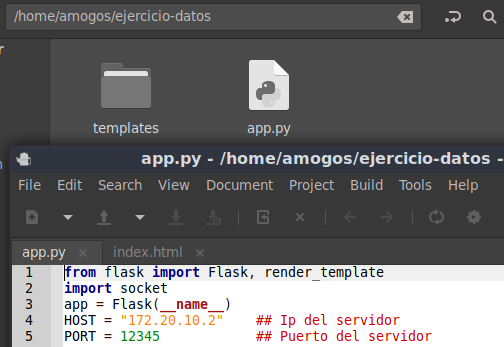

<<<<<<< HEAD
# Actividad Lectura eje X - eje Y

## Objetivo

Aprendizaje

## Observaciones

Actividad en clases 4.2 Desarrollo de Software para Hardare, Junio 2026
=======

## Objetivo

* Clonar el repositorio y trabajar en una copia personal
* Ejecutar Flask y recibir datos **x, y** desde una aplicación móvil
* Visualizar datos en una página HTML sencilla
* Subir cambios a GitHub

---

## Descarga de Aplicación APK

Se puede descargar la aplicación móvil desde aquí:

[Descargar XYaTCPfull.apk](./XYaTCPfull.apk)

---

## Pasos básicos

### 1. Clonar el repositorio

```bash
git clone https://github.com/jotaefepece/Actividad-dataXY-base
cd Actividad-dataXY-base
```

### 2. Instalar y ejecutar la aplicación apk

```bash
### La red del celular tiene que estar en la misma red local ###
```

### 3. Ejecutar Flask

```bash
python3 app.py
```

### 4. Probar en el navegador

```
http://127.0.0.1:5000
```

---

## Estructura del ejercicio

```bash
.
├── app.py
├── capturas
│   ├── archivos-base.png
│   └── vista-base.png
├── README.md
├── templates
│   └── index.html
└── XYaTCPfull.apk
```

---

## Capturas

### Estructura de archivos



---

### Vista en el navegador


---

## Inicio del ejercicio

* Se modifica matriz base por una 5x5
* Se cambia formato de vista interfaz web
* se añaden 2 pestañas extra de facil acceso mediante botones en interfaz web


---
>>>>>>> 242b2a9 (Subiendo contenido copiado de repositorio base)
